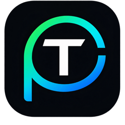

# TokenForge

**Only verified issuers can turn real financial agreements into programmable onchain assets.**

Upload a loan agreement, invoice, or bond term sheet; an AI extracts the economic terms with per-field confidence scores; after human review and issuer approval, a cash-flow-programmed RWA token is minted on X Layer and its coupons pay holders in USDG.

Built for the OKX "Build X" AI Season Hackathon (X Layer, Aug 7–21, 2026), AI-RWA track.

## The problem

Tokenizing a real-world debt instrument today means a human reads a non-standardized legal PDF and manually transcribes principal, rate, day-count, maturity, schedule, and covenants into a contract deployment. That transcription step is the bottleneck, and it doesn't scale.

TokenForge puts an LLM on that critical path. Remove the model and there is no product — only manual paralegal data entry.

## How it works

```text
Issuer and borrower are admitted to the registry, under separate roles
        ↓
Verified issuer uploads the signed PDF     → stored in R2, hashed, text read out
        ↓
AI extracts terms with per-field confidence
        ↓
Deterministic validator checks internal consistency
        ↓
AI checks whose document it is, and whether we have seen it before
        ↓
Human reviews low-confidence fields
        ↓
Issuer submits the exact parameters for approval
        ↓
Registry admin clears those exact parameters on-chain
        ↓
Issuer signs the mint — Pending, document hash stored on-chain
        ↓
Borrower accepts the terms from their own wallet     → the note goes Active
        ↓
Issuer places a share of the note on the sale desk
        ↓
Investors buy in and hold proportional shares
        ↓
Borrower deposits USDG repayments
        ↓
Holders claim principal + interest pro-rata
```

### Three parties, kept apart

A loan has three sides, and collapsing any two of them tells a lie:

| | |
|---|---|
| **Issuer** | Originated the loan and is selling it to get their capital back early. Mints the note, holds the whole supply, places part of it for sale |
| **Borrower** | Owes the money. Named at issuance, must be in the registry, and must sign `accept()` before the note does anything. Repays into the vault |
| **Holders** | Own the repayments. Buy from the offering, claim their share, and can sell on |

Until the borrower accepts, a minted note is only the issuer's assertion *about*
someone else — so it stays `Pending` and cannot be transferred, offered, or
repaid. Only that wallet's own key can clear it.

Paying, though, is open to anyone. A guarantor or a servicer may legitimately
settle a period, and restricting it to one address would let a lost key strand
a performing loan.

## The trust stack

No single check is trusted on its own. Five layers each do a different job:

| Layer | What it establishes |
|---|---|
| Company verification | Corporate identity and an authorized representative; only registered issuers can mint |
| AI verification | Extracts terms, cross-checks the document, flags inconsistencies, scores confidence |
| Human verification | A person reads the source document and confirms or corrects the AI's output |
| Issuer approval | The authorized representative signs off on the final terms on-chain |
| Document provenance | A model checks the agreement names this issuer as lender, and that the same loan has not already been tokenized under a different file |
| Admin approval | The registry admin clears one exact set of mint parameters. Editing anything afterwards produces a different hash and the factory refuses it |
| Borrower acceptance | The named borrower signs `accept()` from their own wallet. Nothing trades or settles until they do |
| Onchain enforcement | Terms are immutable, the document hash is recorded, the repayment schedule is enforced by contract |

**Issuer verification is an eligibility layer, not a safety guarantee.** A reputable company can still originate a bad loan. Verification controls *who may issue*; it says nothing about whether a particular loan will be repaid. Credit risk remains entirely with the investor.

## Handling uncertainty

An LLM cannot extract facts a document was written to obscure. TokenForge is built around that limit rather than pretending it away.

The three checks fail independently, and the difference matters:

- **Confidence scoring** comes from a second model pass that audits the first against the source. It answers *how sure was the model*.
- **The deterministic validator** is rules, not AI. It checks that dates are ordered, principal reconciles, the cadence matches the declared frequency, and the schedule reproduces the stated rate against a declining balance. It ignores confidence entirely — terms a model was certain about still fail when the arithmetic doesn't hold.
- **Human review** clears low-confidence fields. Terms can be arithmetically perfect and still too uncertain to mint unsupervised.

So `INVALID` and `NEEDS_REVIEW` mean genuinely different things: the first cannot be cleared by any amount of human confirmation, the second is waiting for someone to vouch for a field.

This is not theoretical. Running the deliberately contradictory sample document through the real pipeline:

```
interestRatePct  0.50  6
  note: Clause 2 states 6% but the payment table implies 9.4%
        ($35,250 semi-annually on $750,000).

validator blocking: Scheduled interest totals 211,500, but 6% on a
30/360 basis implies 135,000.                    → status INVALID
```

The model extracted the *stated* rate rather than quietly reconciling it, and the validator caught the contradiction independently.

## Layout

```text
packages/core   Extraction schema and deterministic validator — one copy,
                imported by both the web app and the service
backend         Hono on Bun · Prisma over Postgres · Gemini · R2
                PDFs parsed on upload; scans transcribed by the model
web             Next.js · wagmi/viem · Reown AppKit
contracts       Foundry · deployed and verified on X Layer testnet
```

`packages/core` exists because the validator decides whether terms may reach a contract. Two copies would eventually disagree — a reviewer's browser approving what the server would refuse, or worse the reverse.

## Deployed — X Layer testnet (chain 1952)

| Contract | Address | |
|---|---|---|
| `IssuerRegistry` | [`0x0422508c0aFB8fEa40365E7781e0248699824375`](https://www.oklink.com/xlayer-test/address/0x0422508c0afb8fea40365e7781e0248699824375) | Verified |
| `NoteFactory` | [`0xDAce270A9991E838bC858884156022fd5ae43aDa`](https://www.oklink.com/xlayer-test/address/0xdace270a9991e838bc858884156022fd5ae43ada) | Verified |
| `SaleDesk` | [`0xDA9DD5Ab32372507fFcD662f6FE1608901c1bbF5`](https://www.oklink.com/xlayer-test/address/0xda9dd5ab32372507ffcd662f6fe1608901c1bbf5) | Verified |
| `MockUSDG` | [`0x6AF29b12f4df68C9416A0DC87B80a718ed054A94`](https://www.oklink.com/xlayer-test/address/0x6af29b12f4df68c9416a0dc87b80a718ed054a94) | Verified · testnet only |

`RWANote` and `RepaymentVault` are deployed per agreement by `NoteFactory`; read them from its `NoteMinted` events. Full record in [contracts/deployments/xlayer-testnet.json](contracts/deployments/xlayer-testnet.json), including superseded addresses and why each was replaced.

`NoteFactory` and `SaleDesk` have both been redeployed. Earlier factories minted
notes with no borrower, which the app still reads and treats as payable by the
issuer; earlier desks let the issuer name their own price, and the first of them
quoted zero for amounts small enough to round down.

No notes are live: the database was reset when the registry and factory were
last replaced. Earlier notes remain on-chain under the superseded factories
but are no longer indexed.

**X Layer testnet is chain 1952**, confirmed against the RPC — `eth_chainId` returns `0x7a0` on both `xlayertestrpc.okx.com` and `testrpc.xlayer.tech`. The 195 figure that circulates is wrong. Mainnet is 196.

## Running it

```bash
pnpm install                      # workspace: web + packages/core

cd backend
cp .env.example .env              # add GEMINI_API_KEY, R2_* for file storage
bun install
bun run db:up                     # Postgres in Docker
bun run db:migrate
bun run db:seed                   # sample documents, no model key needed
bun run dev                       # :8787

cd ../web
cp .env.example .env.local        # addresses are in the deployments JSON
pnpm dev                          # :3000

cd ../contracts
forge test                        # 118 tests
```

The seed loads two documents with hand-written extractions, so the review flow works without a model key or any spend. The validator runs for real over them.

For the full pipeline, [samples/](samples/) has four PDFs to upload — the happy path, the contradictory note that should be refused, an amortizing loan, and an invoice.

## Scope and honesty statement

This is a hackathon prototype. It uses sample documents and mock loans on X Layer testnet.

**Deliberately out of scope:** legal enforceability, SPV wrappers, custody, regulated investor onboarding, and secondary-market liquidity. Creating a token is the easy part; proving a loan is trustworthy and sellable is the hard part, and TokenForge does not claim to solve it.

**Partially stubbed:** issuer verification. The `IssuerRegistry` and its on-chain enforcement are real — an unregistered address genuinely cannot mint — but admission to the registry is a manual off-chain decision here, not a KYB integration.

**What is real:** the document-to-validated-terms pipeline running against a live model, the deterministic validator, document storage with on-chain-matching hashes, the primary offering, and the repayment logic with 118 passing tests.

## What is not built yet

Stated plainly, because a demo can hide these:

- **Most of it has never been signed from a browser.** Placing an offering has:
  `fundPool` for 400 tokens landed at block 37982017 from the issuer wallet, a
  transaction no script in this repository sent. Mint, accept, repay, claim, and
  buy are all wired to the contracts and signed by the connected wallet, and
  every one has been exercised on testnet — but by a scripted signer. That gap
  remains the largest untested surface.
- **Automated repayment has no interface yet.** `collectFromBorrower` and the
  standing authorization it needs are on-chain and covered by tests; nothing in
  the app shows the authorization or triggers a collection, and no keeper runs.
- **The borrower's acceptance has never run against a real second wallet.** The
  `Pending` gate is covered by contract tests and by confirming that notes
  predating the role do not trip it.
- **Nothing has been bought.** `raised` is zero on every offering, so the buy
  path — approve, quote, transfer — has only ever run in Foundry.
- **Confidence calibration is unmeasured.** It varies run to run and does produce mid-range values, but whether it is *well* calibrated across many documents is unknown. One document run three times is not evidence.

## Status

Day 6 of 12.
